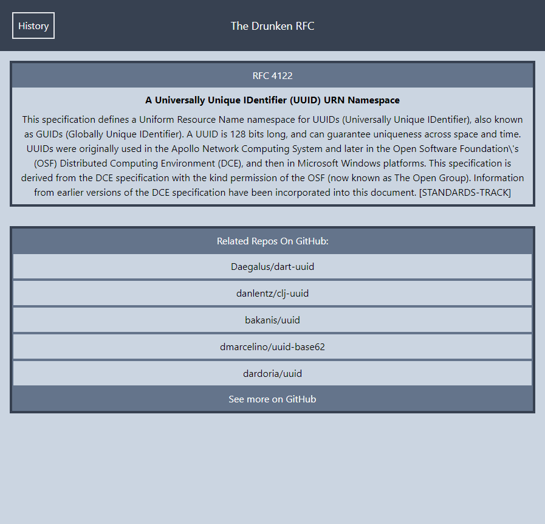

# The Drunken RFC
Project1 (Royce Strange, Chelsea Hernandez, and Daniel Tang)

## Purpose
The purpose for our project "The Druken RFC" is to pick a random RFC to get information about every day.
As I user:
I WANT to broaden my developer knowledge by researching a random RFC every day. This website is targetted towards eager minded individuals who want to learn something new everyday. 

## APIs used
- GitHub api
  https://docs.github.com/en/rest
- IETF datatracker api
  https://datatracker.ietf.org/api

## CSS framework used
- Tailwindcss
  https://tailwindcss.com/

## Website
https://dt1220.github.io/DrunkenRFC/

